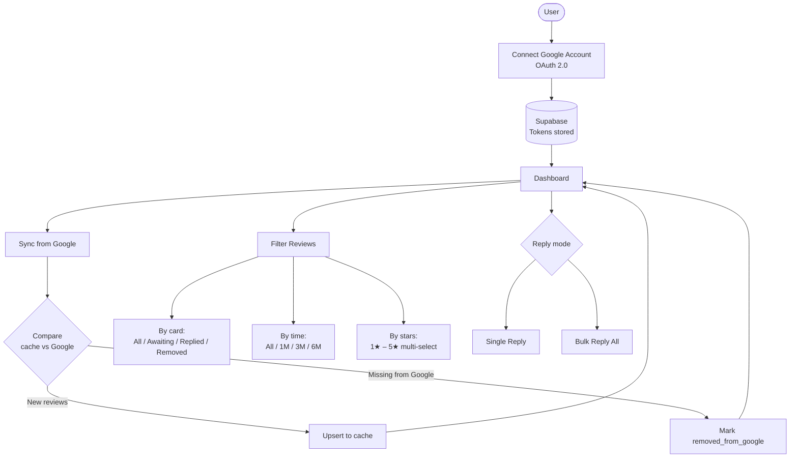
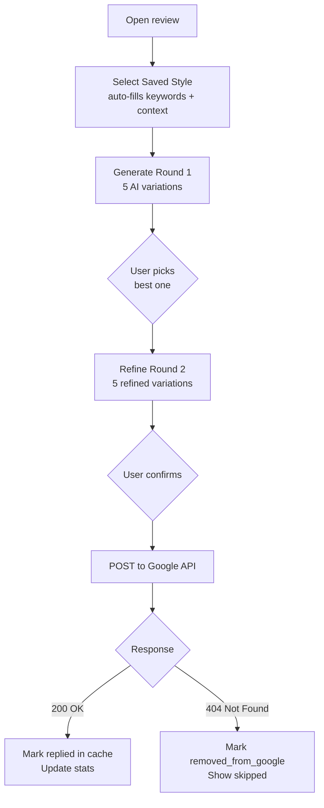
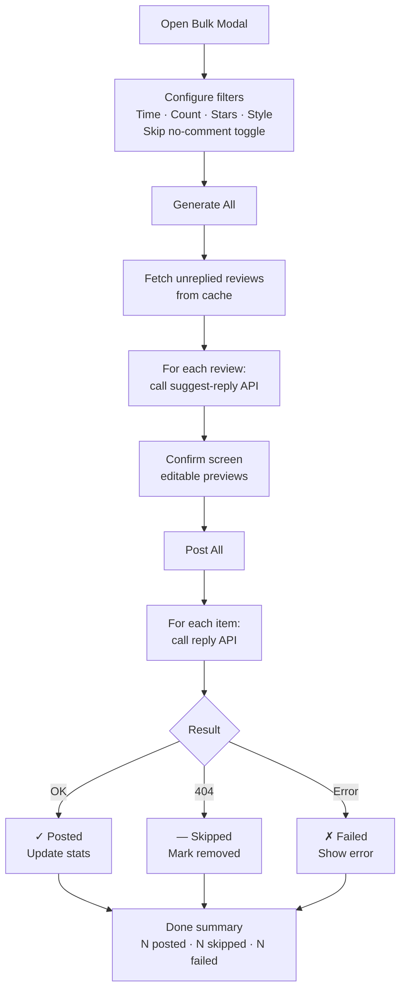
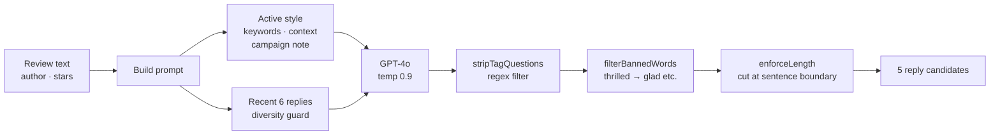
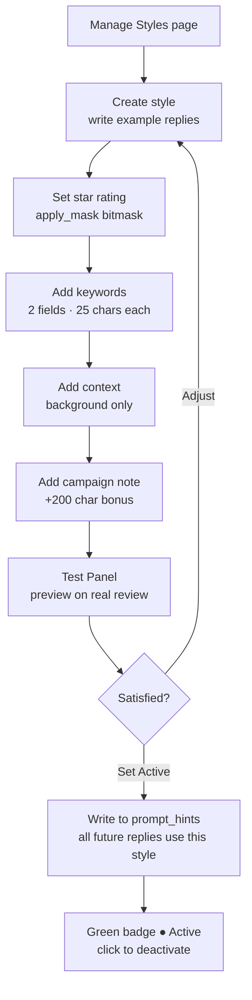
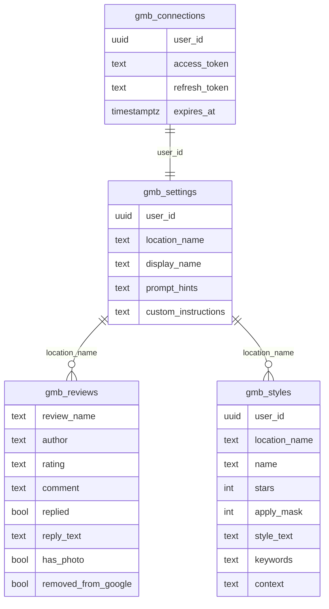

# GMB Review Reply — System Overview

## User Journey

---

## Single Reply Flow

---

## Bulk Reply Flow

---

## AI Reply Quality Pipeline

---

## Style Management Flow

---

## Data Layer

