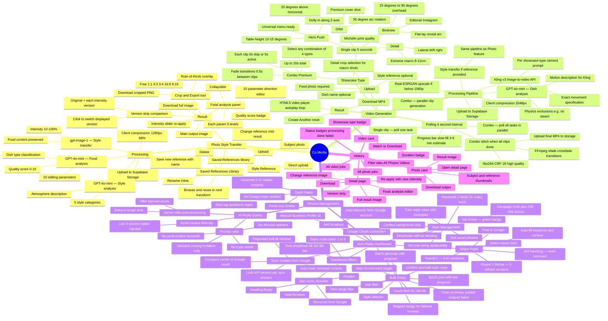

# Co.Media — Product Overview

```mermaid
mindmap
  root((Co.Media))
    Photo Style Transfer
      Upload
        Subject photo
        Style Reference
          Direct upload
          Saved References library
      Processing
        Client compression 1280px 88%
        Upload to Supabase Storage
        GPT-4o-mini — Food analysis
          Dish type classification
          Quality score 0-10
          10 editing parameters
        GPT-4o-mini — Style analysis
          5 style categories
          Atmosphere description
        gpt-image-1 — Style transfer
          Intensity 10-100%
          Food content preserved
      Result
        Main output image
        Version strip comparison
          Original + each intensity version
          Click to switch displayed version
        Intensity slider re-apply
        Change reference mid-result
        Food analysis panel
          Collapsible
          Quality score badge
          10 parameter direction editor
          Each param 5 levels
        Crop and Export tool
          Free 1:1 4:3 3:4 16:9 9:16
          Rule-of-thirds overlay
          Download cropped PNG
        Download full image
      Saved References Library
        Save new reference with name
        Browse and reuse in next transform
        Rename inline
        Delete

    Video Generation
      Upload
        Food photo required
        Style reference optional
        Dish name optional
        Detail crop selection for macro shots
      Showcase Type
        Single clip 5 seconds
          Hero Push
            Table-height 10-15 degrees
            Dolly-in along Z-axis
            Universal menu-ready
          Orbit
            20 degrees above horizontal
            35 degree arc rotation
            Premium cover shot
          Birdview
            25 degrees to 90 degrees overhead
            Flat-lay reveal arc
            Editorial Instagram
          Detail
            Extreme macro 8-12cm
            Lateral drift right
            Michelin print quality
        Combo Premium
          Select any combination of 4 types
          Each clip 0s skip or 5s active
          Fade transitions 0.5s between clips
          Up to 20s total
      Processing Pipeline
        Client compression 2048px
        Upload to Supabase Storage
        Real-ESRGAN upscale if below 1080p
        GPT-4o-mini — Dish analysis
          Motion description for Kling
          Physics exclusions e.g. no steam
        Style transfer if reference provided
          Same pipeline as Photo feature
        Kling v3 image-to-video API
          Per showcase-type camera prompt
          Exact movement specification
        Combo — parallel clip generation
      Polling 4 second interval
        Single clip — poll one task
        Combo — poll all tasks in parallel
        Progress bar slow-fill 3-5 min estimate
        Combo stitch when all clips done
          FFmpeg xfade crossfade transitions
          libx264 CRF 18 high quality
          Upload final MP4 to storage
      Result
        HTML5 video player autoplay loop
        Download MP4
        Create Another reset

    Review Management
      Quick Reply
        No Google login needed
        Paste any review
        Generate 5 AI replies instantly
      Auto Reply Dashboard
        Google OAuth connection
        Add locations
          Auto-discover from Google account
          Manual Business Profile ID
        Sync reviews from Google
          Paginated pull all reviews
          Lock API version per sync session
          Compare cache vs Google result
          Auto-mark removed reviews
        Dashboard filters
          Stat cards clickable
            Total Reviews
            Awaiting Reply
            Replied
            Removed from Google
          Time dropdown All 1M 3M 6M
          Stars multi-select 1 to 5
        Single Reply
          Select saved style
          Auto-fill keywords and context
          Round 1 — 5 AI variations
          Round 2 Refine — 5 refined versions
          Post to Google
          404 handling — mark removed
        Bulk Reply
          Time range filter
          Count limit 50 100 All
          Star filter
          Style selector
          Skip no-comment toggle
          Batch generate with progress
          Confirm and edit each reply
          Batch post with live progress
          Skipped badge for deleted reviews
          Done summary posted skipped failed
        Style Management
          Train reply voice with examples
          Set star rating applicability
          Keywords 2 fields 25 chars each
          Context background only
          Campaign note plus 200 char bonus
          Test panel preview
          Set Active — green badge
          Deactivate without deleting
      AI Reply Quality
        Server-side post-processing
          Strip tag questions regex
          Filter banned words
          Enforce length limit
        Cross-review diversity
          Last 6 posted replies injected
        Prompt rules
          No performative farewells
          No hype words
          No effusive openers
          Genuine closing invitation only

    History
      All photo jobs
      All video jobs
      Filter tabs All Photos Videos
      Status badges processing done failed
      Photo card
        Subject and reference thumbnails
        Result image
        Open detail page
        Download output
      Video card
        Showcase type badge
        Duration badge
        Watch or Download
      Detail page
        Full result image
        Version strip
        Re-apply with new intensity
        Change reference image
        Food analysis editor
        Download
```
