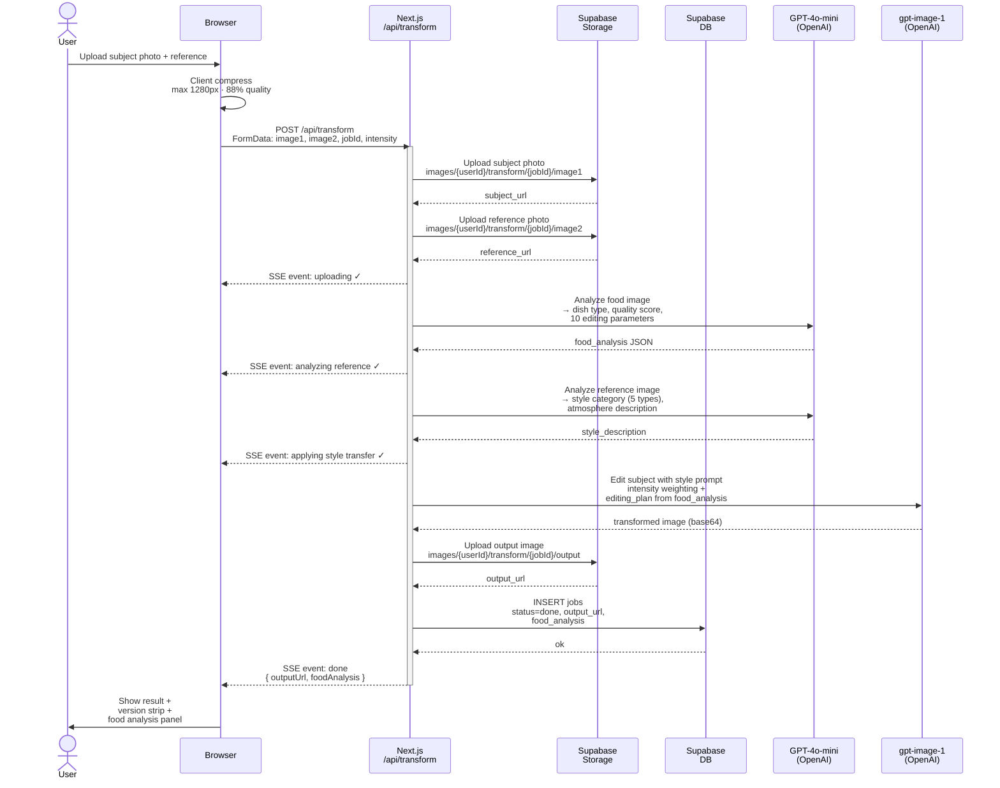
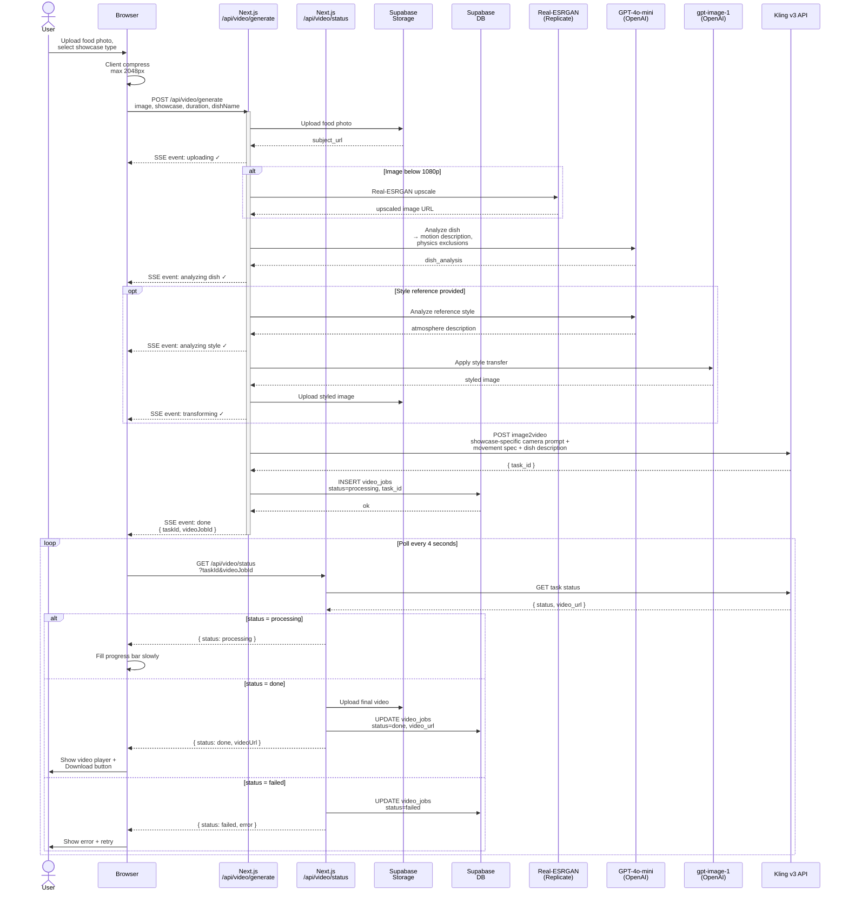
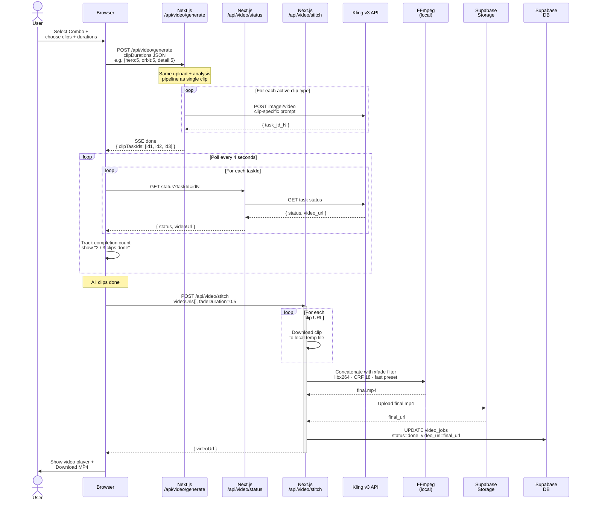
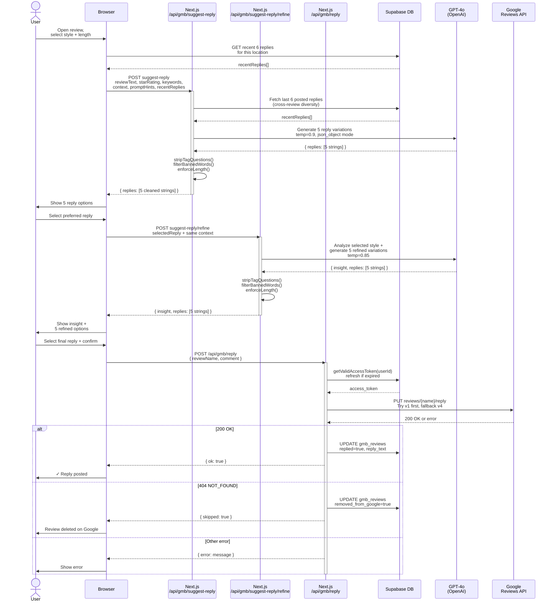
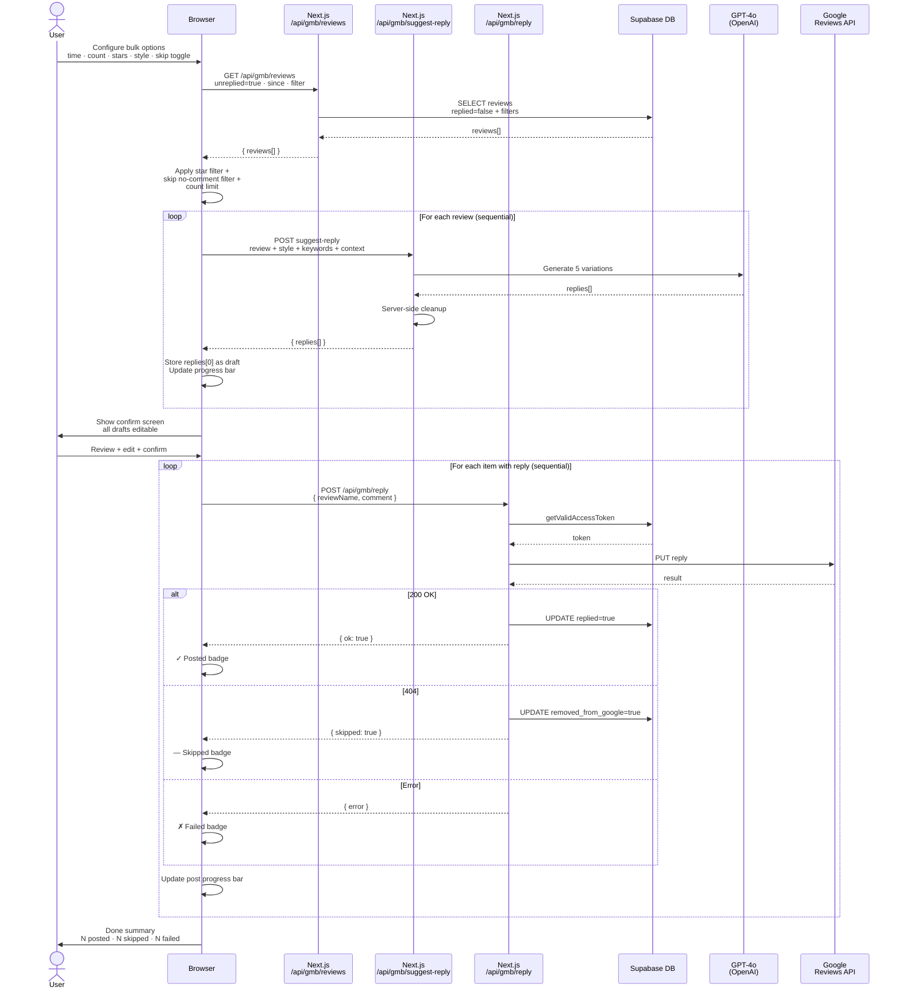
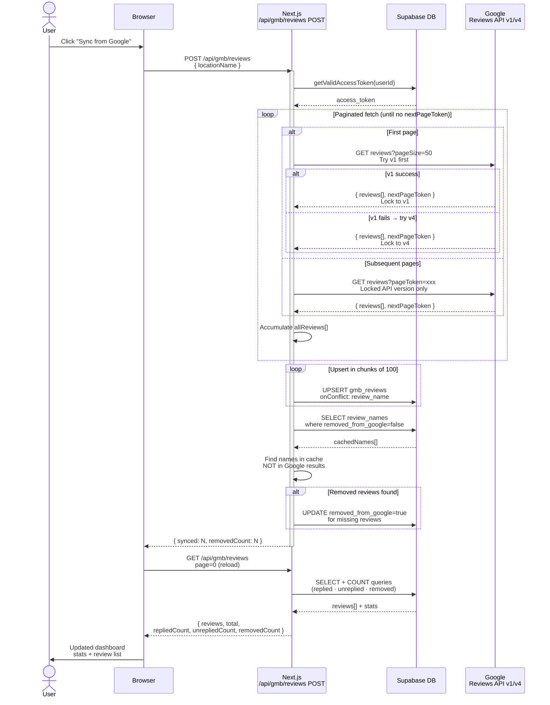

# Co.Media — System Flows & Tool Calls

---

## 1. Photo Style Transfer

---

## 2. Video Generation — Single Clip

---

## 3. Video Generation — Combo (Multi-Clip)

---

## 4. Review Reply — Single

---

## 5. Bulk Reply

---

## 6. Reviews Sync from Google

